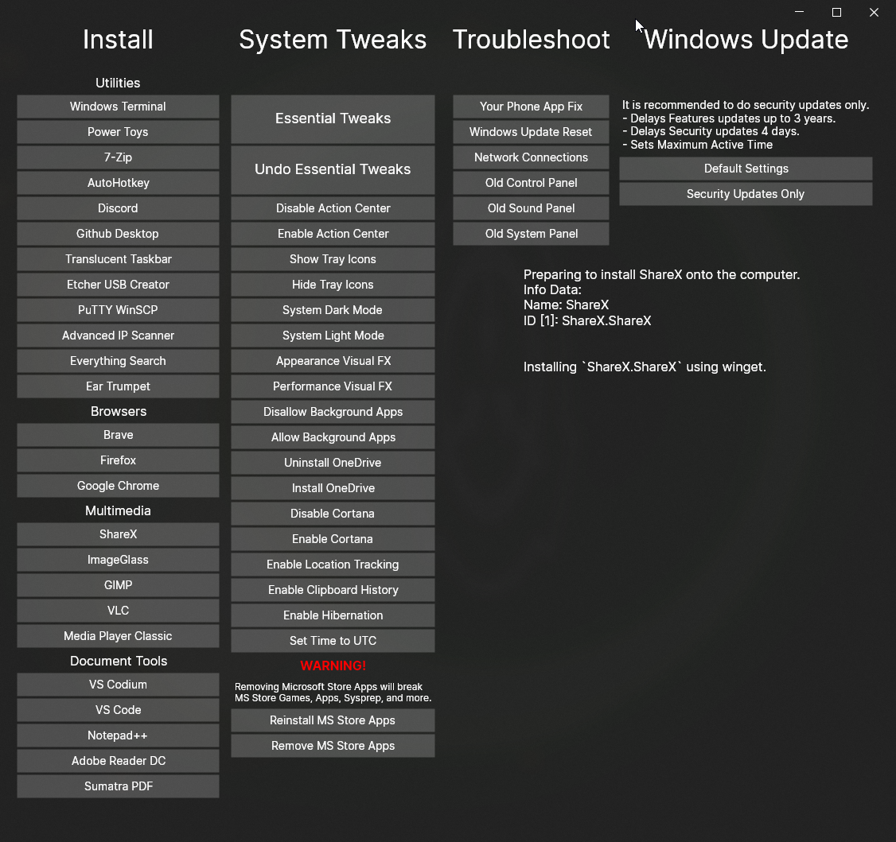

# Ultimate Windows Toolbox
This script is the culmination of many scripts and gists from github with features of my own. I am building this script to be a swiss army knife of Windows tools to help setup and optimize machines.

## My Additions
- Changed the UI from WinForms to using AvaloniaUI.
- Switched mostly away from PowerShell to C#.
  - Some methods still call to PowerShell for help, might change later.
- Added EarTrumpet to the list.

## How to Run
Download it from the Releases section off to the side. Once downloaded, simply run it by double clicking on it.

For complete details check out https://christitus.com/debloat-windows-10-2020/

## How to build
First thing you will need is .NET 5 SDK, which can be downloaded [here](https://dotnet.microsoft.com/en-us/download/dotnet/5.0). Do note that it _should_ work with .NET 6, but haven't tested that yet.
After downloading and installing .NET, you can either press the Code button and download ZIP file, or you can use `git`. If you use `git`, all you have to do is `git clone https://github.com/TechNGamer/CTT-Debloat.NET.git`
in the terminal. After that there is a few choices as to how to build it:
- Install an Integrated Development Environment (IDE)
    - Rider (Recommend, cost money)
        - Has Avalonia extension [here](https://github.com/ForNeVeR/AvaloniaRider).
    - Visual Studio
        - Has Avalonia extension [here](https://github.com/avaloniaui/avaloniavs).
- Beefed up Text Editor
    - Visual Studio Code/Codium
    - Notepad++
- Command Line

<sup>NOTE: If you download as a zip file, extract it before doing anything.</sup>

If you choose to use an IDE, look up how to compile a .NET project that way. Compiling the project through the command line is simple, type `cd` and the full path to the directory it is in.
If the project directory is on a different drive, make sure you type that drive letter first before `cd`'ing. Next type `dotnet publish -r win-x64 -c Release -p:PublishSingleFile=true -p:PublishTrimmed=true --self-contained CTTDebloat.NET.sln`
This will give you a single file with nothing extra. After that you just run the program as it will be located at `./CTTDebloatNET/bin/Release/net5.0-windows/publish/CTTDebloatNET.exe`.
If that fails, do `cd ./CTTDebloatNET/` and rerun that command without the `.sln` file.

## Reason for the change
There is a couple of reasons I wanted to do this. The primary reason is that I wanted to see how much I could translate to C#.
The second reason is that I disliked the use of WinForms as it is single-threaded. Whenever interacting with a GUI, the GUI controls
have to be on a single thread. However, the logic can be sent to another. In WinForms, to my understanding, this can be done, just not easily.
Using something like Avalonia (or WPF/UWP) would enable the logic to be sent to background Tasks.

### Why Avalonia
I used Avalonia since I've been trying that out a bit. I like Avalonia since I can make a UI that works on Windows, macOS, and Linux.
I would have used Windows Presentation Foundation, however Avalonia is like WPF but also covers some boiler plate code. Like if you instantiate
a ViewModel, it attempts to find the corresponding View. With WPF, it seems like you have to make it find the Views when instantiate a ViewModel.

Lastly, I am mostly a Linux user, I attempt to send as little time in Windows as possible since it gives me a lot of trouble. That might be from
me trying to use it as a power user. But it might also come down to how Linux does what I want it to do, just better. Since I use both Rider (from JetBrains)
and Avalonia, I can work on the user interface in Linux. Then either reboot into Windows or fire up a Virtual Machine and test it there. If I was to use
WPF, I would have to stay in Windows, which again, I do not like.

## Recent Changes
###17/01/2022:

Recently change the look of the application to use Acrylic, should look a lot nicer now.

Also, instead of it attempting to parse the data that `winget` is sending to the command prompt, the program just opens a command prompt that is going to run `winget`.
This will show what `winget` is doing and should help keep things a bit clean.

Lastly, the program now uses a JSON file that is embedded into the program itself that will tell the program what programs needs to be listed under the install section.
It will also check for a special file in the working directory called `expand.json`, this enabled people to bundle this program, or download extra json files, to enable
a bigger selection of programs to install using `winget`.

It is quite easy to add new installs, simple create a file called `expand.json` with the start and end being curly braces. Next you will type in double quotes the section
the program goes into. See the table below for what each section's name is.

| Section               | Keyword      |
|-----------------------|--------------|
| Utilities             | `utilities`  |
| Web Browsers          | `browsers`   |
| Video and Image Tools | `multimedia` |
| Document Tools        | `documents`  |

Outside the double quote, you will place a colon `:` and type a square bracket `[`. Next another curley and now (and again in double quotes), type `displayName` with the colon
being outside the double quotes. Followed by another double quote and the name of the program. End with a comma and go to the next line and type `id`. This time you will need a
square bracket. Next line and type the `winget` ID of the program, if there are multiple to bundle together, each entry will need a comma at the end.
It should look something like the JSON below:

```json5
// This is the start of expand.json.
{
  // The section this is going in is Document Tools
  "documents":[
    {
      // A button with this name will appear on it.
      "displayName": "Jetbrains Toolbox",
      // This is the list of IDs that will be used in installing the program(s).
      "id":[
        "JetBrains.Toolbox"
      ]
    }    
  ],
  // An example that is from the built-in JSON.
  "utilities":[
    {
      "displayName": "PuTTY WinSCP",
      "id": [
        "PuTTY.PuTTY",
        "WinSCP.WinSCP"
      ]
    }
  ]
}
```
Do note that there can only be 1 of each section, having multiple may result in either nothing showing, or only 1 section showing. After you've typed all of that you,
simply launch the program and the new entries will be shown.

## Notices
Since there are some things that I didn't want to dig into during this transformation, and as said above, it still somewhat relies on PowerShell.
Especially when dealing with services. As such, you might see something like below when doing something like the Essential Tweaks:


<sub>This wallpaper is something I made myself using Unity and Wallpaper Engine. Reacts to sounds that are played.</sub>

This program relies on the following:
 - PowerShell (built into Windows)
 - winget

### PowerShell
Some things are still left for PowerShell (as seen/mentioned above), but most of the things have been translated over to C#.
However, controlling services through C# seems like it might be a bit complex. However, PowerShell enabled easier control.
So the program makes basic commands/scripts to execute in PowerShell.

### winget
`winget` is used to install programs with ease. It uses an internal dictionary to figure out what program needs to be installed and what it's
ID is for `winget`.

## Might add later
 * ~~Might add an acrylic effect.~~
 * Selection box to download and install multiple programs at once instead of individually.
 * ~~Add scroll views to the install column to enable more programs without having to make the window taller.~~
 * Better handling of service manipulations.
 * Output to a log file on the desktop.
